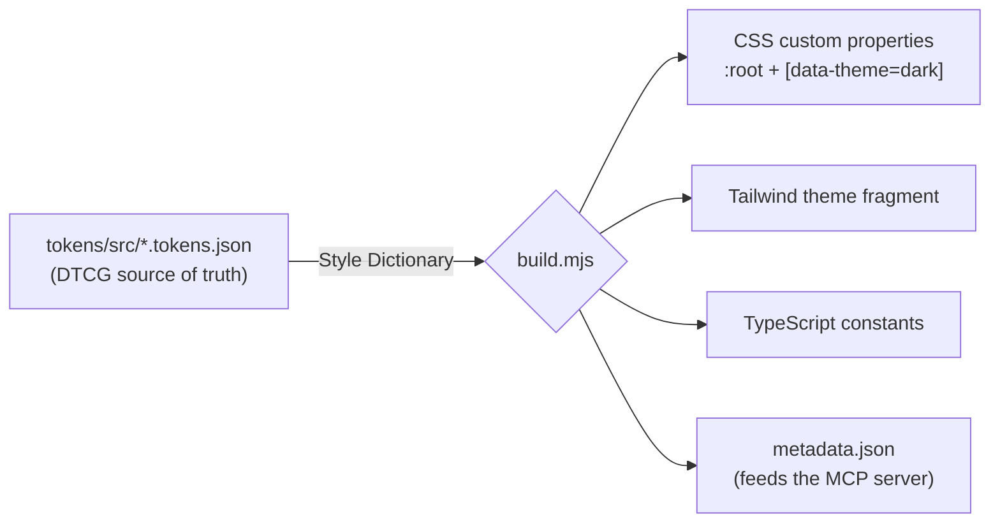

# Strake

A small, accessible React component library with a **visible token pipeline** and
an **agent-queryable design-system API**.

**[→ Live Storybook](https://codysue.github.io/strake/)** · ten components, light/dark,
keyboard-operable, driven entirely by design tokens.

Strake is a portfolio-grade design system, built to be *read* as much as used. It is
deliberately compact, but nothing is faked: every component is real, the token
pipeline actually runs, and the whole thing is wired for accessibility.

---

## Three ideas it demonstrates

### 1. A token pipeline you can watch move

One [W3C DTCG](https://www.w3.org/community/design-tokens/) source of truth compiles,
through [Style Dictionary](https://styledictionary.com), into every output a real
system needs:



Change one value in `tokens/src`, run **one** command, and it propagates to all four
outputs at once:

```bash
pnpm build:tokens
```

Because the generated outputs are committed, a token change shows up in review as a
readable diff across CSS, Tailwind, and TypeScript in the same PR. And CI runs a
**drift guard** — if the committed outputs ever fall out of sync with the source, the
build fails:

```bash
pnpm tokens:check   # rebuilds, then fails if tokens/dist changed
```

That propagation — one source, many platforms, enforced — is the whole point. See it
rendered live under **Foundations → Tokens** in Storybook.

### 2. Accessibility as engineering, not decoration

- **Dialog** and **Command menu** use a **hand-built focus trap** (`useFocusTrap`):
  Tab wraps, initial focus moves in, Escape closes, focus returns to the trigger.
- **Select** is a full listbox — Up/Down, Home/End, type-ahead, `aria-activedescendant`.
- **Command menu** is a `role="combobox"` driving a `role="listbox"`.
- **DataTable** is keyboard-navigable with roving `tabindex` and `aria-sort`.
- One focus ring, defined once as a token, reused everywhere via `:focus-visible`.

Verified with `axe-core` (0 violations across components in light and dark), and every
story runs the Storybook a11y addon live.

### 3. The design system as a queryable API

A companion read-only MCP server, [`@codysue/strake-mcp`](./mcp), exposes the same
tokens and component metadata as tools an agent can call — `list_tokens`, `get_token`,
`list_components`, `get_component`, plus `strake://tokens` and `strake://components`
resources. The design system stops being a static artifact and becomes something an
agent can read. It is deliberately hardened; see [SECURITY.md](./SECURITY.md).

---

## Components

| | |
|---|---|
| **Button** | variants, sizes, loading state |
| **TextField** | label, description, error, adornments |
| **Switch** | `role="switch"`, controlled/uncontrolled |
| **Select** | accessible listbox with type-ahead |
| **Tooltip** | hover + focus, Floating UI |
| **Popover** | click-triggered, managed focus |
| **Dialog** | hand-built focus trap, scroll lock |
| **Command menu** | ⌘K combobox palette |
| **Toast** | imperative API, `aria-live` region |
| **DataTable** | sortable, keyboard-navigable |

## Quick start

```bash
pnpm add @codysue/strake
```

```tsx
import { Button, ToastProvider, useToast } from '@codysue/strake';
import '@codysue/strake/styles.css';

function App() {
  return (
    <ToastProvider>
      <Save />
    </ToastProvider>
  );
}

function Save() {
  const { toast } = useToast();
  return <Button onClick={() => toast({ title: 'Saved', variant: 'success' })}>Save</Button>;
}
```

Dark mode is a single attribute — `<html data-theme="dark">` — because every color is
a semantic token.

### Using the tokens directly

```js
// tailwind.config.js
const strake = require('@codysue/strake-tokens/tailwind');
module.exports = { theme: { extend: strake } };
```

```ts
import { tokens } from '@codysue/strake-tokens'; // theme-aware var() references
```

---

## Architecture

A pnpm workspace:

```
strake/
├── tokens/          @codysue/strake-tokens  — DTCG source → Style Dictionary → outputs
├── packages/react/  @codysue/strake         — the component library (tsup build)
├── mcp/             @codysue/strake-mcp      — the read-only MCP server
├── stories/         Storybook stories + the live token gallery
└── .storybook/      Storybook config (React + Vite)
```

## Scripts

| Command | What it does |
|---|---|
| `pnpm build:tokens` | Compile DTCG tokens → CSS / Tailwind / TS / metadata |
| `pnpm tokens:check` | Rebuild tokens and fail on drift |
| `pnpm build` | Build tokens, library, and MCP server |
| `pnpm typecheck` | Typecheck every package |
| `pnpm storybook` | Run Storybook locally |
| `pnpm build:storybook` | Build the static Storybook |

## Tech

React · TypeScript · Style Dictionary · Floating UI · Framer Motion · Storybook · Vite ·
tsup · Model Context Protocol SDK.

## License

[MIT](./LICENSE) © Cody Clark
